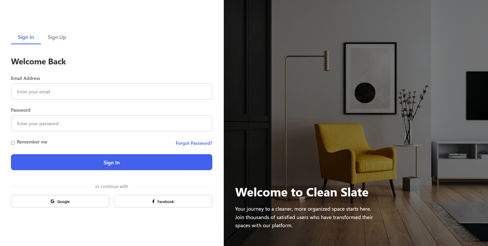
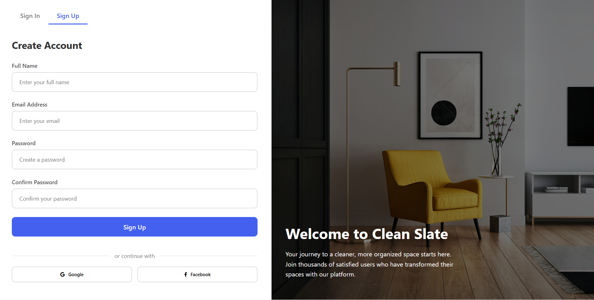

# Clean Slate Login System

A modern, responsive login and signup page with a beautiful gradient background and smooth animations.

##  Features

- **Responsive Design**: Works perfectly on desktop, tablet, and mobile devices
- **Modern UI**: Clean, professional interface with smooth animation
- **Dual Forms**: Separate Sign In and Sign Up forms with tab switching
- **Social Login**: Google and Facebook login options
- **Form Validation**: Client-side form validation and user feedback
- **Gradient Background**: Beautiful purple-to-blue gradient background
- **Smooth Animations**: Fade-in effects and hover animations
- **Font Awesome Icons**: Professional social media icons

##  Design

- **Left Panel**: Clean white form area with input fields and buttons
- **Right Panel**: Eye-catching background image with welcome text
- **Color Scheme**: Modern blue (#4361ee) primary color with complementary grays
- **Typography**: Segoe UI font family for excellent readability
- **Responsive**: Mobile-first design that adapts to all screen sizes

## 📁 Project Structure

```
Login/
├── index.html          # Main HTML file
├── styles.css          # CSS styles and animations
└── README.md          # Project documentation
```

## 🛠️ Technologies Used

- **HTML5**: Semantic markup and modern structure
- **CSS3**: Flexbox, Grid, animations, and responsive design
- **JavaScript**: DOM manipulation and form handling
- **Font Awesome**: Icon library for social media buttons
- **Unsplash**: High-quality background images

##  Getting Started

### Prerequisites

- A modern web browser (Chrome, Firefox, Safari, Edge)
- No additional dependencies required

### Installation

1. Clone the repository:
   ```bash
   git clone https://github.com/LungeloMK/clean-slate-login.git
   ```

2. Navigate to the project directory:
   ```bash
   cd clean-slate-login
   ```

3. Open `index.html` in your web browser:
   ```bash
   # Option 1: Double-click the file
   # Option 2: Right-click and "Open with" your browser
   # Option 3: Use a local server (recommended for development)
   ```

### Local Development Server

For the best development experience, use a local server:

```bash
# Using Python 3
python -m http.server 8000

# Using Node.js (if you have it installed)
npx serve .

# Using PHP
php -S localhost:8000
```

Then visit `http://localhost:8000` in your browser.

## 📱 Responsive Breakpoints

- **Desktop**: 1200px and above
- **Tablet**: 900px - 1199px
- **Mobile**: Below 900px (right panel hidden)

##  Features in Detail

### Form Functionality
- **Tab Switching**: Smooth transition between Sign In and Sign Up forms
- **Form Validation**: Basic client-side validation
- **Remember Me**: Checkbox for persistent login
- **Forgot Password**: Link for password recovery
- **Social Login**: Google and Facebook integration placeholders

### Animations
- **Fade In**: Forms appear with smooth fade-in animation
- **Hover Effects**: Buttons and inputs have interactive hover states
- **Transform**: Subtle lift effects on button hover
- **Transitions**: Smooth color and size transitions

##  Customization

### Colors
The main color scheme can be customized by modifying these CSS variables:

```css
/* Primary blue color */
#4361ee

/* Hover state */
#3250d4

/* Background gradient */
linear-gradient(135deg, #6a11cb 0%, #2575fc 100%)
```

### Background Image
Replace the Unsplash image URL in the `.right-panel` CSS:

```css
background: linear-gradient(rgba(0, 0, 0, 0.5), rgba(0, 0, 0, 0.5)), 
            url('YOUR_IMAGE_URL') center/cover no-repeat;
```

## 📸 Screenshots

### Login Page

*Clean and modern login interface with gradient background*

### Sign Up Page

*Responsive signup form with smooth animations*

### Features Showcase
The project includes responsive design that works across all devices:
- Desktop view with both panels visible
- Mobile view with only the form panel
- Smooth animations and hover effects
- Beautiful gradient backgrounds
- Professional form styling

##  Contributing

1. Fork the repository
2. Create a feature branch (`git checkout -b feature/amazing-feature`)
3. Commit your changes (`git commit -m 'Add some amazing feature'`)
4. Push to the branch (`git push origin feature/amazing-feature`)
5. Open a Pull Request

##  License

This project is open source and available under the [MIT License](LICENSE).

##  Author

Created with ❤️ by LungeloMK

##  Acknowledgments

- [Font Awesome](https://fontawesome.com/) for the amazing icons
- [Unsplash](https://unsplash.com/) for the beautiful background image
- Modern CSS techniques and best practices

## 📞 Support

If you have any questions or suggestions, please feel free to:
- Open an issue on GitHub
- Contact me directly
- Submit a pull request

---

⭐ Star this repository if you found it helpful!
